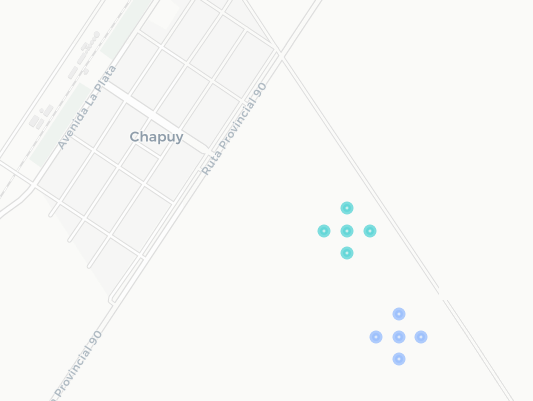
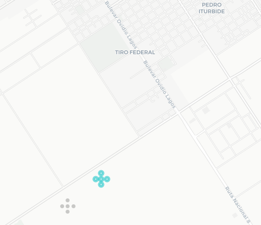
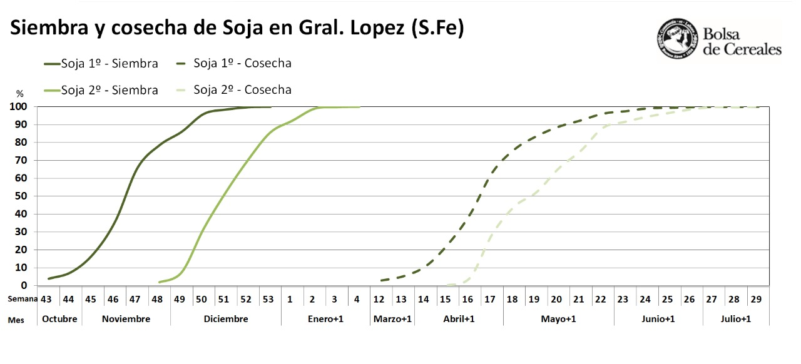
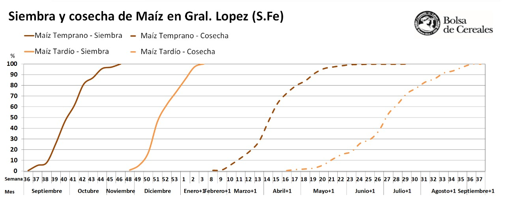
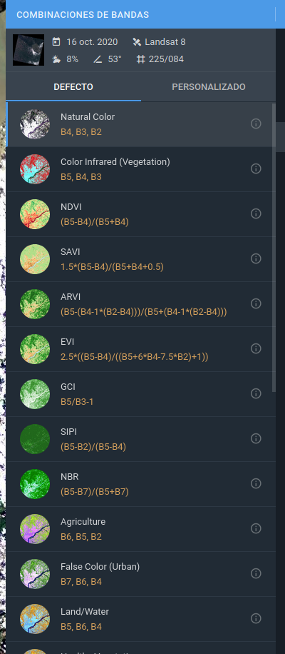
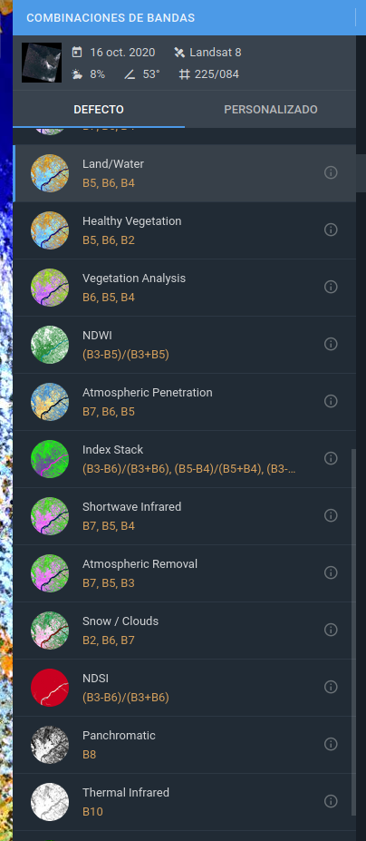
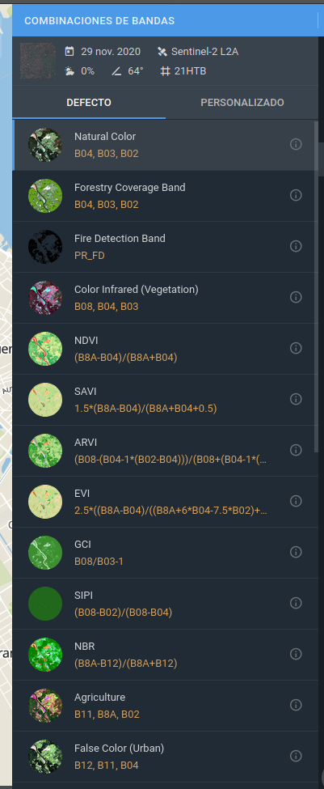
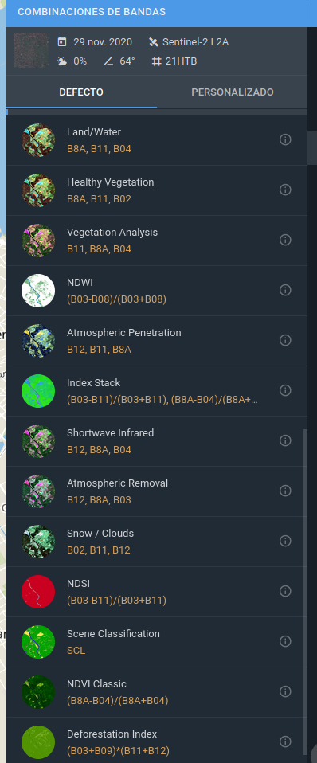

# Resumen
El presente informe intenta explicar los pasos realizados para generar el mismo archivo *.csv* de submit, que se subió el domingo 13/12/2020, con el que se obtuvo un puntaje público de **0,62262**.

Se comienza con un análisis exploratorio en **R**, con la data original del concurso. La idea general para el entrenamiento de los algoritmos, es separar por campañas, y utilizar un 70% para TRAIN, y el restante 30% para VALID. También en esta etapa, se utiliza la idea de *A. Campos*, de agregar puntos cercanos para aumentar los casos (pero solo en las clases que poseen pocas observaciones). De esos puntos, los *originales*, se usaron en el dataset de validación, y los restantes, se pusieron en el de entrenamiento.

Luego se sigue con un procesado de imágenes y features en **Python** con **Google Earth Engine**, basados en las presentaciones de *S. Banchero*, y creación de índices obtenidos de la pagina recomendada por *Y. Bellini* en su webinar (https://eos.com/landviewer).
También en esta etapa, se crean **4 ventanas de tiempo**, para tratar de diferenciar las métricas de agrupamiento para 8 colecciones de imágenes diferentes (4 para L8 y 4 para S2).

Ventanas:

* La **ventana 1**, va desde la semana **36**, a la **36** del siguiente año; para tratar de separar las **campañas**.
* La **ventana 2**, va desde la semana **36**, a la **10** del siguiente año; para hacer foco en las **siembras**.
* *Hubo un intento de ventana 3, desde la semana 10, a la 36 del mismo año; para hacer foco en las cosechas, pero no se utilizó porque había un error de procesamiento en test de la campaña 19/20.*
* La **ventana 4**, va desde la semana **52**, a la **12** del siguiente año; para hacer foco en el **forraje a full**.
* La ultima **ventana 5**, es desde la semana **36**, a la **52** del mismo año; para enfocarse en el periodo de **siembra, pero sin el forraje a full**.

Terminada esta etapa de procesado de imágenes y features de indices, se pasa nuevamente a **R** para la utilización del framework **h2o** para el entrenamiento de los algoritmos **Random Forest**, y **XGBoost**.
Para terminar, se hace un ensemble de estos 2 algoritmos, y se obtienen las predicciones del dataset de test, para luego armar el submit que fue subido a la competencia.

**NOTAS**: *Los parámetros de los algoritmos se obtuvieron luego de un grid search, pero no se pudo hacer el grid serach en este informe, ya que arrojaba un error de h2o.*<br/>
*Tampoco se procesan en python todos los registros de los datasets. Solo se procesan 3 registros por cada uno de ellos; pero se deja comentado la forma para poder generar todo el procesamiento. En la etapa de entrenamiento, se cargan los datasets completos, generados con anterioridad.*


# Análisis exploratorio

Carga de la data original

```r
data_test  <- read_csv("../data/data_test.csv")
data_train <- read_csv("../data/data_train.csv")
Etiquetas  <- read_csv("../data/Etiquetas.csv")
```

Función para refactorizar tipo de datos

```r
cambiar_tipo <- function(dataset){
  retorno <- dataset %>% 
                mutate(
                  Campania = as.factor(Campania),
                  Dataset = as.factor(Dataset), 
                  CLASE = as.factor(Cultivo)
                ) %>% 
              select(-c(Cultivo))
  
  return(retorno)
}
```


TRAIN

```r
data_train <- cambiar_tipo(data_train)
summary(data_train)
```

```
##        Id           Longitud         Latitud         Elevacion        
##  Min.   :  1.0   Min.   :-62.86   Min.   :-34.38   Min.   : -0.00002  
##  1st Qu.:119.0   1st Qu.:-62.10   1st Qu.:-33.87   1st Qu.: 99.85998  
##  Median :235.0   Median :-61.92   Median :-33.80   Median :103.86926  
##  Mean   :243.9   Mean   :-61.91   Mean   :-33.80   Mean   :102.92332  
##  3rd Qu.:366.8   3rd Qu.:-61.71   3rd Qu.:-33.67   3rd Qu.:109.47998  
##  Max.   :550.0   Max.   :-61.21   Max.   :-33.46   Max.   :126.77998  
##                                                                       
##  Dataset    Campania      GlobalId          CLASE    
##  BC :561   18/19:294   Min.   :   1.0   S      :344  
##  BCR:289   19/20:556   1st Qu.: 411.5   M      :210  
##                        Median : 758.5   s      : 89  
##                        Mean   : 750.6   N      : 82  
##                        3rd Qu.:1108.5   P      : 55  
##                        Max.   :1455.0   X      : 34  
##                                         (Other): 36
```
TEST

```r
data_test <- cambiar_tipo(data_test)
summary(data_test)
```

```
##        Id           Longitud         Latitud         Elevacion        
##  Min.   :  1.0   Min.   :-62.81   Min.   :-34.37   Min.   : -0.00002  
##  1st Qu.:136.5   1st Qu.:-62.12   1st Qu.:-33.88   1st Qu.: 99.23191  
##  Median :253.0   Median :-61.95   Median :-33.80   Median :104.23316  
##  Mean   :251.0   Mean   :-61.91   Mean   :-33.80   Mean   :103.46553  
##  3rd Qu.:367.5   3rd Qu.:-61.69   3rd Qu.:-33.65   3rd Qu.:109.91555  
##  Max.   :549.0   Max.   :-61.31   Max.   :-33.46   Max.   :125.09998  
##  Dataset    Campania      GlobalId       CLASE    
##  BC :371   18/19:228   Min.   :   2.0   NA's:555  
##  BCR:184   19/20:327   1st Qu.: 333.0             
##                        Median : 726.0             
##                        Mean   : 718.3             
##                        3rd Qu.:1089.0             
##                        Max.   :1454.0
```

## Diferencias entre Id y GlobalId

```r
data_train %>% group_by(Id, GlobalId) %>% count() %>% arrange(Id) %>% head()
```

<div class="kable-table">

| Id| GlobalId|  n|
|--:|--------:|--:|
|  1|        1|  1|
|  1|      551|  1|
|  2|      984|  1|
|  3|      985|  1|
|  4|        4|  1|
|  4|      554|  1|

</div>
De lo anterior, se ve que hay Id repetidos, pero con distinto GlobalId.
Se va a tomar GlobalId como unico ID


## Chequeo de GlobalId's repetidos

```r
data_train %>% group_by(GlobalId) %>% count() %>% arrange(-n) %>% head()
```

<div class="kable-table">

| GlobalId|  n|
|--------:|--:|
|        1|  1|
|        4|  1|
|        6|  1|
|        7|  1|
|        9|  1|
|       10|  1|

</div>
Se ve que no hay GlobalId's repetidos


## Distribución de clases

```r
data_train %>% group_by(CLASE) %>% count() %>% arrange(-n)
```

<div class="kable-table">

|CLASE |   n|
|:-----|---:|
|S     | 344|
|M     | 210|
|s     |  89|
|N     |  82|
|P     |  55|
|X     |  34|
|U     |  12|
|B     |   6|
|R     |   6|
|m     |   4|
|A     |   2|
|aa    |   2|
|T     |   2|
|G     |   1|
|S/M   |   1|

</div>


## Anti Join para ver los IDs que no tienen etiquetas
Ya que el submit es por ID de etiquetas

```r
data_train %>% 
  anti_join(Etiquetas, by = c("CLASE" = "Cultivo"))
```

<div class="kable-table">

|  Id|  Longitud|  Latitud| Elevacion|Dataset |Campania | GlobalId|CLASE |
|---:|---------:|--------:|---------:|:-------|:--------|--------:|:-----|
| 278| -62.03234| -33.5726|  109.6636|BC      |18/19    |      278|S/M   |

</div>


El **GlobalId 278** se elimina ya que no está la CLASE S/M taggeada

```r
data_train <- data_train %>% filter(GlobalId != 278)
```

## Ver si algún punto tiene 2 clasificaciones diferentes

```r
data_train %>% group_by(Longitud, Latitud, Campania) %>% count()  %>% arrange(-n) %>% head()
```

<div class="kable-table">

|  Longitud|   Latitud|Campania |  n|
|---------:|---------:|:--------|--:|
| -62.01045| -33.78365|18/19    |  2|
| -62.86169| -34.37533|19/20    |  1|
| -62.83579| -34.35495|19/20    |  1|
| -62.83024| -34.34878|19/20    |  1|
| -62.83022| -34.33978|19/20    |  1|
| -62.82581| -34.33320|19/20    |  1|

</div>


Se busca el punto que tiene n = 2 para ver si las las clases son iguales (en cuyo caso no habría mucho problema)

```r
data_train %>% filter(round(Longitud,5) == -62.01045,
                      round(Latitud,5) == -33.78365,
                      Campania == '18/19')
```

<div class="kable-table">

|  Id|  Longitud|   Latitud| Elevacion|Dataset |Campania | GlobalId|CLASE |
|---:|---------:|---------:|---------:|:-------|:--------|--------:|:-----|
| 227| -62.01045| -33.78365|  95.07975|BC      |18/19    |      227|X     |
| 228| -62.01045| -33.78365|  95.07975|BC      |18/19    |      228|S     |

</div>

Se eliminan los **GlobalId 227 y 228**, ya que tiene 2 CLASES diferentes para la misma campaña ('X' y 'S')

```r
data_train <- data_train %>% filter(GlobalId != 227, GlobalId != 228)
```


Gráfico con escala logarítmica de la distribución de clases separados por campaña

```r
data_ggplot <- data_train %>%
                select(Dataset, Campania, CLASE, GlobalId) %>%
                group_by(CLASE, Campania) %>%
                mutate(cantidad = n())


data_ggplot %>%
    ggplot(aes(x = reorder(CLASE, -cantidad), fill = CLASE)) +
    geom_bar(stat="count") +
    facet_grid(rows = vars(Campania)) +
    scale_y_log10() +
    labs(title = 'Cantidad de valores por CLASE, separados por Campania')
```

<!-- -->

Se observa que en algunas campañas, no hay datos de algunas clases

# Separación de la data en campañas

```r
separarCampania <- function(paramData, paramCampania){
  retorno <- paramData %>% filter(Campania == paramCampania) 
  return(retorno)
}

data_train_18_19 <- separarCampania(data_train, paramCampania = '18/19')
data_train_19_20 <- separarCampania(data_train, paramCampania = '19/20')

data_test_18_19 <- separarCampania(data_test, paramCampania = '18/19')
data_test_19_20 <- separarCampania(data_test, paramCampania = '19/20')
```


## Nueva distribución de las clases

```r
data_train_18_19 %>% group_by(CLASE) %>% count() %>% arrange(-n)
```

<div class="kable-table">

|CLASE |   n|
|:-----|---:|
|S     | 154|
|M     |  82|
|N     |  25|
|P     |  10|
|X     |   8|
|R     |   6|
|aa    |   2|
|A     |   1|
|G     |   1|
|m     |   1|
|s     |   1|

</div>


```r
data_train_19_20 %>% group_by(CLASE) %>% count() %>% arrange(-n)
```

<div class="kable-table">

|CLASE |   n|
|:-----|---:|
|S     | 189|
|M     | 128|
|s     |  88|
|N     |  57|
|P     |  45|
|X     |  25|
|U     |  12|
|B     |   6|
|m     |   3|
|T     |   2|
|A     |   1|

</div>

Se ven las clases que tienen 6 o menos observaciones.

18_19

| CLASE | CANTIDAD |
|------:|-----:|
|R  | 6|
|aa | 2|
|A  | 1|
|G  | 1|
|m  | 1|
|s  | 1|

19_20

| CLASE | CANTIDAD |
|------:|-----:|
|B|6|
|m|3|
|T|2|
|A|1|


## Separación por pocas observaciones


```r
data_train_pocos_18_19 <- data_train_18_19 %>% 
                            filter(CLASE %in% c("R", "aa", "A", "G", "m", "s"))
data_train_muchos_18_19 <- data_train_18_19 %>% 
                            filter(! CLASE %in% c("R", "aa", "A", "G", "m", "s"))

data_train_pocos_19_20 <- data_train_19_20 %>% 
                            filter(CLASE %in% c("B", "m", "T", "A"))
data_train_muchos_19_20 <- data_train_19_20 %>% 
                            filter(! CLASE %in% c("B", "m", "T", "A"))
```


Ver distancia mínima para que no se superpongan los nuevos puntos a crear

```r
library(geodist)
library(geosphere)
dMin_18_19 <- georange(cbind(data_train_pocos_18_19$Longitud, 
                              data_train_pocos_18_19$Latitud))
cat(c("Distancia minima en campaña 18/19: ",dMin_18_19[1]))
```

```
## Distancia minima en campaña 18/19:  373.749271692646
```

```r
dMin_19_20 <- georange(cbind(data_train_pocos_19_20$Longitud, 
                              data_train_pocos_19_20$Latitud))
cat(c("Distancia minima en campaña 18/19: ",dMin_19_20[1]))
```

```
## Distancia minima en campaña 18/19:  480.612194781304
```


La distancia mínima es de **370 mts**, así que tomando distancias menores a **150 mts**, no se superpondrían.


Creación de los puntos para Norte, S, E y O, a 90mts para cada uno

```r
#agrego un tag para guardar el punto original, y después pasarlo al set de validación

data_train_pocos_18_19$orig <- TRUE
data_train_pocos_19_20$orig <- TRUE

crearNuevoPuntos <- function(paramData){
  df_nuevos_puntos <- NULL
  distancia = 90
  
  for (j in 1:nrow(paramData))
  {
    row <- paramData[j,]
    lon <- row$Longitud
    lat <- row$Latitud
    
    #punto original
    df_nuevos_puntos <- rbind(df_nuevos_puntos, row)
    
    for(b in seq(0, 359, by = 90)){ #angulos
      nuevo_punto <- geosphere::destPointRhumb(p = c(lon, lat), b = b, d = distancia)
      aux <- row
      aux$Longitud <- nuevo_punto[1]
      aux$Latitud <- nuevo_punto[2]
      
      aux$orig <- FALSE # se tagea como punto NO original
      
      #print(row)
      #print(aux)
      df_nuevos_puntos <- rbind(df_nuevos_puntos, aux)
    }
  }
  
  return(df_nuevos_puntos)
} 

#df_nuevos_puntos
data_train_pocos_18_19 <- crearNuevoPuntos(data_train_pocos_18_19)
data_train_pocos_19_20 <- crearNuevoPuntos(data_train_pocos_19_20)
```


## Mapa para los "pocos datos" de la campaña 18/19
Para ver si los puntos extras, fueron bien creados.

```r
data <- data_train_pocos_18_19
cant_clases <- data %>% group_by(CLASE) %>% select(CLASE) %>% n_distinct

array_colores <- hue_pal()(cant_clases)

data %>%
  leaflet() %>%
  addProviderTiles("CartoDB") %>%
  addCircleMarkers(
    lng = ~Longitud, 
    lat = ~Latitud, 
    popup = ~GlobalId, 
    color = ~array_colores[CLASE],
    radius = 4,
    label = ~CLASE) 
```

<!--html_preserve--><div id="htmlwidget-7abb7c822d6719a36455" style="width:576px;height:384px;" class="leaflet html-widget"></div>
<script type="application/json" data-for="htmlwidget-7abb7c822d6719a36455">{"x":{"options":{"crs":{"crsClass":"L.CRS.EPSG3857","code":null,"proj4def":null,"projectedBounds":null,"options":{}}},"calls":[{"method":"addProviderTiles","args":["CartoDB",null,null,{"errorTileUrl":"","noWrap":false,"detectRetina":false}]},{"method":"addCircleMarkers","args":[[-33.8144410685742,-33.8136325848185,-33.8144410685742,-33.8152495523299,-33.8144410685742,-33.8666427600161,-33.8658342762603,-33.8666427600161,-33.8674512437718,-33.8666427600161,-33.6301924372359,-33.6293839534802,-33.6301924372359,-33.6310009209916,-33.6301924372359,-33.627223043844,-33.6264145600883,-33.627223043844,-33.6280315275997,-33.627223043844,-33.8069563419854,-33.8061478582297,-33.8069563419854,-33.8077648257412,-33.8069563419854,-33.8348908503942,-33.8340823666384,-33.8348908503942,-33.8356993341499,-33.8348908503942,-33.7609176182624,-33.7601091345067,-33.7609176182624,-33.7617261020181,-33.7609176182624,-33.7589923835438,-33.7581838997881,-33.7589923835438,-33.7598008672995,-33.7589923835438,-33.8040700257013,-33.8032615419456,-33.8040700257013,-33.804878509457,-33.8040700257013,-33.8078414594729,-33.8070329757172,-33.8078414594729,-33.8086499432287,-33.8078414594729,-33.6294597392878,-33.6286512555321,-33.6294597392878,-33.6302682230436,-33.6294597392878,-33.6346656158443,-33.6338571320886,-33.6346656158443,-33.6354740996001,-33.6346656158443],[-62.1772781708482,-62.1772781708482,-62.1763050838064,-62.1772781708482,-62.1782512578899,-62.1774171145874,-62.1774171145874,-62.1764434329473,-62.1774171145874,-62.1783907962274,-62.0075583934124,-62.0075583934125,-62.0065873928116,-62.0075583934125,-62.0085293940132,-62.0094572911815,-62.0094572911815,-62.0084863240509,-62.0094572911815,-62.0104282583122,-62.0160108042139,-62.0160108042139,-62.0150378023005,-62.0160108042139,-62.0169838061274,-61.7839747597459,-61.7839747597459,-61.7830014399557,-61.7839747597459,-61.7849480795362,-61.6726808246448,-61.6726808246448,-61.6717083456654,-61.6726808246448,-61.6736533036242,-61.6688367145269,-61.6688367145269,-61.6678642573895,-61.6688367145269,-61.6698091716642,-61.7361317988806,-61.7361317988805,-61.7351588297865,-61.7361317988805,-61.7371047679746,-61.7339086990533,-61.7339086990533,-61.7329356870745,-61.7339086990533,-61.7348817110321,-61.3812463316677,-61.3812463316677,-61.3802753393261,-61.3812463316677,-61.3822173240093,-61.3783748277242,-61.3783748277242,-61.3774037766937,-61.3783748277242,-61.3793458787547],4,null,null,{"interactive":true,"className":"","stroke":true,"color":["#F8766D","#F8766D","#F8766D","#F8766D","#F8766D",null,null,null,null,null,"#B79F00","#B79F00","#B79F00","#B79F00","#B79F00","#B79F00","#B79F00","#B79F00","#B79F00","#B79F00",null,null,null,null,null,null,null,null,null,null,null,null,null,null,null,null,null,null,null,null,"#00BFC4","#00BFC4","#00BFC4","#00BFC4","#00BFC4","#619CFF","#619CFF","#619CFF","#619CFF","#619CFF",null,null,null,null,null,null,null,null,null,null],"weight":5,"opacity":0.5,"fill":true,"fillColor":["#F8766D","#F8766D","#F8766D","#F8766D","#F8766D",null,null,null,null,null,"#B79F00","#B79F00","#B79F00","#B79F00","#B79F00","#B79F00","#B79F00","#B79F00","#B79F00","#B79F00",null,null,null,null,null,null,null,null,null,null,null,null,null,null,null,null,null,null,null,null,"#00BFC4","#00BFC4","#00BFC4","#00BFC4","#00BFC4","#619CFF","#619CFF","#619CFF","#619CFF","#619CFF",null,null,null,null,null,null,null,null,null,null],"fillOpacity":0.2},null,null,[28,28,28,28,28,109,109,109,109,109,201,201,201,201,201,203,203,203,203,203,233,233,233,233,233,386,386,386,386,386,422,422,422,422,422,424,424,424,424,424,443,443,443,443,443,455,455,455,455,455,487,487,487,487,487,488,488,488,488,488],null,["A","A","A","A","A","R","R","R","R","R","aa","aa","aa","aa","aa","aa","aa","aa","aa","aa","R","R","R","R","R","s","s","s","s","s","R","R","R","R","R","R","R","R","R","R","G","G","G","G","G","m","m","m","m","m","R","R","R","R","R","R","R","R","R","R"],{"interactive":false,"permanent":false,"direction":"auto","opacity":1,"offset":[0,0],"textsize":"10px","textOnly":false,"className":"","sticky":true},null]}],"limits":{"lat":[-33.8674512437718,-33.6264145600883],"lng":[-62.1783907962274,-61.3774037766937]}},"evals":[],"jsHooks":[]}</script><!--/html_preserve-->

Imagen de ejemplo del mapa




## Mapa para los "pocos datos" de la campaña 19/20

```r
data <- data_train_pocos_19_20
cant_clases <- data %>% group_by(CLASE) %>% select(CLASE) %>% n_distinct

array_colores <- hue_pal()(cant_clases)

data %>%
  leaflet() %>%
  addProviderTiles("CartoDB") %>%
  addCircleMarkers(
    lng = ~Longitud, 
    lat = ~Latitud, 
    popup = ~GlobalId, 
    color = ~array_colores[CLASE],
    radius = 4,
    label = ~CLASE) 
```

<!--html_preserve--><div id="htmlwidget-9eef61924374558448be" style="width:576px;height:384px;" class="leaflet html-widget"></div>
<script type="application/json" data-for="htmlwidget-9eef61924374558448be">{"x":{"options":{"crs":{"crsClass":"L.CRS.EPSG3857","code":null,"proj4def":null,"projectedBounds":null,"options":{}}},"calls":[{"method":"addProviderTiles","args":["CartoDB",null,null,{"errorTileUrl":"","noWrap":false,"detectRetina":false}]},{"method":"addCircleMarkers","args":[[-33.6695248436786,-33.6687163599229,-33.6695248436786,-33.6703333274343,-33.6695248436786,-33.8817798566716,-33.8809713729159,-33.8817798566716,-33.8825883404273,-33.8817798566716,-33.8035850729033,-33.8027765891476,-33.8035850729033,-33.804393556659,-33.8035850729033,-33.9319518028975,-33.9311433191418,-33.9319518028975,-33.9327602866532,-33.9319518028975,-33.7906915985705,-33.7898831148148,-33.7906915985705,-33.7915000823262,-33.7906915985705,-33.7867654386193,-33.7859569548636,-33.7867654386193,-33.787573922375,-33.7867654386193,-33.6483642017577,-33.647555718002,-33.6483642017577,-33.6491726855134,-33.6483642017577,-33.6518196017559,-33.6510111180002,-33.6518196017559,-33.6526280855116,-33.6518196017559,-33.8126397131991,-33.8118312294434,-33.8126397131991,-33.8134481969548,-33.8126397131991,-33.8286655530924,-33.8278570693367,-33.8286655530924,-33.8294740368481,-33.8286655530924,-33.6638065891028,-33.6629981053471,-33.6638065891028,-33.6646150728585,-33.6638065891028,-33.8124743070436,-33.8116658232879,-33.8124743070436,-33.8132827907993,-33.8124743070436],[-61.9044503071114,-61.9044503071114,-61.9034788627029,-61.9044503071114,-61.9054217515199,-62.1447654445413,-62.1447654445413,-62.1437915901965,-62.1447654445413,-62.1457392988862,-62.0007849947919,-62.0007849947919,-61.9998120312117,-62.0007849947919,-62.0017579583722,-62.1003844985108,-62.1003844985108,-62.0994100708107,-62.1003844985108,-62.1013589262109,-61.976006694634,-61.976006694634,-61.9750338776008,-61.976006694634,-61.9769795116672,-61.9701710575874,-61.9701710575874,-61.9691982851603,-61.9701710575874,-61.9711438300145,-62.3056999251354,-62.3056999251354,-62.3047287196005,-62.3056999251354,-62.3066711306702,-62.3025707963415,-62.3025707963415,-62.3015995518172,-62.3025707963415,-62.3035420408659,-61.8736742688781,-61.8736742688781,-61.8727012023271,-61.8736742688781,-61.8746473354291,-61.4999156104237,-61.4999156104237,-61.4989423615114,-61.4999156104237,-61.500888859336,-61.8740008571538,-61.8740008571538,-61.873029477321,-61.8740008571538,-61.8749722369867,-61.7536662398051,-61.7536662398051,-61.7526931751355,-61.7536662398051,-61.7546393044746],4,null,null,{"interactive":true,"className":"","stroke":true,"color":[null,null,null,null,null,"#F8766D","#F8766D","#F8766D","#F8766D","#F8766D",null,null,null,null,null,"#00BFC4","#00BFC4","#00BFC4","#00BFC4","#00BFC4",null,null,null,null,null,"#00BFC4","#00BFC4","#00BFC4","#00BFC4","#00BFC4","#00BFC4","#00BFC4","#00BFC4","#00BFC4","#00BFC4","#00BFC4","#00BFC4","#00BFC4","#00BFC4","#00BFC4","#00BFC4","#00BFC4","#00BFC4","#00BFC4","#00BFC4","#00BFC4","#00BFC4","#00BFC4","#00BFC4","#00BFC4",null,null,null,null,null,null,null,null,null,null],"weight":5,"opacity":0.5,"fill":true,"fillColor":[null,null,null,null,null,"#F8766D","#F8766D","#F8766D","#F8766D","#F8766D",null,null,null,null,null,"#00BFC4","#00BFC4","#00BFC4","#00BFC4","#00BFC4",null,null,null,null,null,"#00BFC4","#00BFC4","#00BFC4","#00BFC4","#00BFC4","#00BFC4","#00BFC4","#00BFC4","#00BFC4","#00BFC4","#00BFC4","#00BFC4","#00BFC4","#00BFC4","#00BFC4","#00BFC4","#00BFC4","#00BFC4","#00BFC4","#00BFC4","#00BFC4","#00BFC4","#00BFC4","#00BFC4","#00BFC4",null,null,null,null,null,null,null,null,null,null],"fillOpacity":0.2},null,null,[611,611,611,611,611,694,694,694,694,694,758,758,758,758,758,799,799,799,799,799,806,806,806,806,806,808,808,808,808,808,818,818,818,818,818,820,820,820,820,820,873,873,873,873,873,921,921,921,921,921,1098,1098,1098,1098,1098,1376,1376,1376,1376,1376],null,["m","m","m","m","m","A","A","A","A","A","m","m","m","m","m","B","B","B","B","B","m","m","m","m","m","B","B","B","B","B","B","B","B","B","B","B","B","B","B","B","B","B","B","B","B","B","B","B","B","B","T","T","T","T","T","T","T","T","T","T"],{"interactive":false,"permanent":false,"direction":"auto","opacity":1,"offset":[0,0],"textsize":"10px","textOnly":false,"className":"","sticky":true},null]}],"limits":{"lat":[-33.9327602866532,-33.647555718002],"lng":[-62.3066711306702,-61.4989423615114]}},"evals":[],"jsHooks":[]}</script><!--/html_preserve-->

Imagen de ejemplo del mapa




# Armando de **train** y **valid** 

Los puntos extras creados anteriormente, se pasan a TRAIN. Los originales, se pasan a VALID.


```r
data_train_18_19 <- data_train_pocos_18_19 %>% filter(orig == FALSE)
data_valid_18_19 <- data_train_pocos_18_19 %>% filter(! orig == FALSE)

data_train_19_20 <- data_train_pocos_19_20 %>% filter(orig == FALSE)
data_valid_19_20 <- data_train_pocos_19_20 %>% filter(! orig == FALSE)

# eliminacion de la columna para tag
data_train_18_19$orig <- NULL
data_valid_18_19$orig <- NULL

data_train_19_20$orig <- NULL
data_valid_19_20$orig <- NULL
```


También train y valid, pero para las clases con mas casos


```r
#18/19
trainIndex <- createDataPartition(data_train_muchos_18_19$CLASE, 
                                  p = .7, 
                                  list = FALSE, 
                                  times = 1)
aux_train <- data_train_muchos_18_19[ trainIndex,]
aux_valid  <- data_train_muchos_18_19[-trainIndex,]

#agrego las particiones a los anteriores pocos casos
data_train_18_19 <- rbind(data_train_18_19, aux_train)
data_valid_18_19 <- rbind(data_valid_18_19, aux_valid)


#19/20
trainIndex <- createDataPartition(data_train_muchos_19_20$CLASE, 
                                  p = .7, 
                                  list = FALSE, 
                                  times = 1)
aux_train <- data_train_muchos_19_20[ trainIndex,]
aux_valid  <- data_train_muchos_19_20[-trainIndex,]

#agrego las particiones a los anteriores pocos casos
data_train_19_20 <- rbind(data_train_19_20, aux_train)
data_valid_19_20 <- rbind(data_valid_19_20, aux_valid)
```

### Distribuciones de train y valid por campañas


```r
data_train_18_19 %>% group_by(CLASE) %>% count() %>% arrange(-n)
```

<div class="kable-table">

|CLASE |   n|
|:-----|---:|
|S     | 108|
|M     |  58|
|R     |  24|
|N     |  18|
|aa    |   8|
|P     |   7|
|X     |   6|
|A     |   4|
|G     |   4|
|m     |   4|
|s     |   4|

</div>

```r
data_valid_18_19 %>% group_by(CLASE) %>% count() %>% arrange(-n)
```

<div class="kable-table">

|CLASE |  n|
|:-----|--:|
|S     | 46|
|M     | 24|
|N     |  7|
|R     |  6|
|P     |  3|
|aa    |  2|
|X     |  2|
|A     |  1|
|G     |  1|
|m     |  1|
|s     |  1|

</div>

```r
data_train_19_20 %>% group_by(CLASE) %>% count() %>% arrange(-n)
```

<div class="kable-table">

|CLASE |   n|
|:-----|---:|
|S     | 133|
|M     |  90|
|s     |  62|
|N     |  40|
|P     |  32|
|B     |  24|
|X     |  18|
|m     |  12|
|U     |   9|
|T     |   8|
|A     |   4|

</div>

```r
data_valid_19_20 %>% group_by(CLASE) %>% count() %>% arrange(-n)
```

<div class="kable-table">

|CLASE |  n|
|:-----|--:|
|S     | 56|
|M     | 38|
|s     | 26|
|N     | 17|
|P     | 13|
|X     |  7|
|B     |  6|
|m     |  3|
|U     |  3|
|T     |  2|
|A     |  1|

</div>


# Pasaje de R a PYTHON
Se utiliza la biblioteca **reticulate** en **R**


```r
library(reticulate)
```


```r
Sys.setenv(RETICULATE_PYTHON = "/usr/bin/python3.8")
reticulate::py_config()
```

```
## python:         /usr/bin/python3.8
## libpython:      /usr/lib/python3.8/config-3.8-x86_64-linux-gnu/libpython3.8.so
## pythonhome:     //usr://usr
## version:        3.8.5 (default, Jul 28 2020, 12:59:40)  [GCC 9.3.0]
## numpy:          /usr/lib/python3/dist-packages/numpy
## numpy_version:  1.17.4
## 
## NOTE: Python version was forced by RETICULATE_PYTHON
```


```r
#TRAIN
write_csv(x = data_train_18_19, file = paste0('../data/data_train_18_19.csv'))
py$data_train_18_19 <- data_train_18_19

write_csv(x = data_train_19_20, file = paste0('../data/data_train_19_20.csv'))
py$data_train_19_20 <- data_train_19_20


#VALID
write_csv(x = data_valid_18_19, file = paste0('../data/data_valid_18_19.csv'))
py$data_valid_18_19 <- data_valid_18_19

write_csv(x = data_valid_19_20, file = paste0('../data/data_valid_19_20.csv'))
py$data_valid_19_20 <- data_valid_19_20


#TEST
write_csv(x = data_test_18_19, file = paste0('../data/data_test_18_19.csv'))
py$data_test_18_19 <- data_test_18_19

write_csv(x = data_test_19_20, file = paste0('../data/data_test_19_20.csv'))
py$data_test_19_20 <- data_test_19_20
```


# Procesado en PYTHON


```python
import time
import pandas as pd
import numpy as np
import ee
import datetime
```

Inicialización de GEE

```python
# La autenticación se hace previamente y se carga Dockerfile
#ee.Authenticate(quiet= True)

# Inicializar la biblioteca
ee.Initialize()
```

Carga de los datos preprocesados en R

```python
# TRAIN
pd_data_train_18_19 = pd.read_csv("/home/rstudio/data/data_train_18_19.csv")
pd_data_train_19_20 = pd.read_csv("/home/rstudio/data/data_train_19_20.csv")

# VALID
pd_data_valid_18_19 = pd.read_csv("/home/rstudio/data/data_valid_18_19.csv")
pd_data_valid_19_20 = pd.read_csv("/home/rstudio/data/data_valid_19_20.csv")

# TEST
pd_data_test_18_19 = pd.read_csv("/home/rstudio/data/data_test_18_19.csv")
pd_data_test_19_20 = pd.read_csv("/home/rstudio/data/data_test_19_20.csv")
```


Función que retorna las coordenadas para armar las **ROI**, y que estas abarquen todos los puntos de train y test

```python
def getRectangle(paramTrain, paramValid, paramTest):

  minLng = min(paramTrain["Longitud"].min(),
                paramValid["Longitud"].min(), 
                paramTest["Longitud"].min() 
                )
                
  minLat = min(paramTrain["Latitud"].min(),
                paramValid["Latitud"].min(),  
                paramTest["Latitud"].min()  
                )
                
  maxLng = max(paramTrain["Longitud"].max(),
                paramValid["Longitud"].max(), 
                paramTest["Longitud"].max() 
                )
                
  maxLat = max(paramTrain["Latitud"].max(),
                paramValid["Latitud"].max(),  
                paramTest["Latitud"].max()
                )
  
  return minLng, minLat, maxLng, maxLat

```

Regiones de interés, para ambas campañas

```python
ROI_18_19 = ee.Geometry.Rectangle(getRectangle(pd_data_train_18_19, 
                                                pd_data_valid_18_19, 
                                                pd_data_test_18_19))
ROI_19_20 = ee.Geometry.Rectangle(getRectangle(pd_data_train_19_20, 
                                                pd_data_valid_19_20, 
                                                pd_data_test_19_20))
```

Función para obtener las fechas de las semanas que se quieran elegir

```python
def fechasVenta(semIniCamp1, semFinCamp1, semIniCamp2, semFinCamp2):
  ini_18_19 = datetime.datetime.strptime(semIniCamp1 + '-1', "%Y-W%W-%w").strftime("%Y-%m-%d")
  fin_18_19 = datetime.datetime.strptime(semFinCamp1 + '-1', "%Y-W%W-%w").strftime("%Y-%m-%d")
  ini_19_20 = datetime.datetime.strptime(semIniCamp2 + '-1', "%Y-W%W-%w").strftime("%Y-%m-%d")
  fin_19_20 = datetime.datetime.strptime(semFinCamp2 + '-1', "%Y-W%W-%w").strftime("%Y-%m-%d")

  return [ini_18_19, fin_18_19, ini_19_20, fin_19_20]

# Ejemplo para las semanas 36 del 2018 / 19 y 20
array_fechas = fechasVenta("2018-W36", "2019-W36", "2019-W36", "2020-W36")
print(array_fechas)
```

```
## ['2018-09-03', '2019-09-09', '2019-09-09', '2020-09-07']
```

## Idea general de las ventanas de tiempo.
Elegir las imágenes del satélite, para la ROI elegida, entre las fechas calculadas, para las 2 campañas. Y así, armar las colecciones con las imágenes correspondientes.






## LANDSAT (LANDSAT/LC08/C01/T1_SR)

### Filtro de nubes

```python
# Funcion Banchero
# https://code.earthengine.google.com/?scriptPath=users%2Fsantiagobanchero%2Fdesafios-agtech%3AGEE-Ejemplos-002.js

def filtro_nubes(imagen):
  #En esta función utilizamos los bits: 3, 5, 7 y 9
  pixel_qa = imagen.select('pixel_qa')
  bit_mask = 0
  
  bit_mask += 2 ** 3 # Bit 3: Cloud Shadow
  bit_mask += 2 ** 5 # Bit 5: Cloud
  bit_mask += 2 ** 7 # Bits 6-7: Cloud Confidence
  bit_mask += 2 ** 9 # Bits 8-9: Cirrus Confidence
  
  # hacemos un AND entre la banda pixel_qa y nuestra bit_mask  
  mask = pixel_qa.bitwiseAnd(bit_mask)
  
  retorno = imagen.updateMask(mask.eq(0))
  
  return retorno
```


### Ventana de tiempo 1
De la semana **36** a la **36** del siguiente año (como para separar las campañas)


```python
#Campaña 18/19
array_fechas = fechasVenta("2018-W36", "2019-W36", "2019-W36", "2020-W36")
  
v1_coleccion_L8_18_19 = ee.ImageCollection("LANDSAT/LC08/C01/T1_SR") \
                      .filterBounds(ROI_18_19) \
                      .filterDate(array_fechas[0], array_fechas[1]) \
                      .filterMetadata("CLOUD_COVER", "less_than", 30) \
                      .map(filtro_nubes)

cantidad_imagenes = v1_coleccion_L8_18_19.size().getInfo()
print("cantidad_imagenes >>> >>> " + str(cantidad_imagenes))

#Campaña 19/20
```

```
## cantidad_imagenes >>> >>> 42
```

```python
v1_coleccion_L8_19_20 = ee.ImageCollection("LANDSAT/LC08/C01/T1_SR") \
                      .filterBounds(ROI_19_20) \
                      .filterDate(array_fechas[2], array_fechas[3]) \
                      .filterMetadata("CLOUD_COVER", "less_than", 30) \
                      .map(filtro_nubes)

cantidad_imagenes = v1_coleccion_L8_19_20.size().getInfo()
print("cantidad_imagenes >>> >>> " + str(cantidad_imagenes))
```

```
## cantidad_imagenes >>> >>> 63
```

### Ventana de tiempo 2
De la semana **36** a la **10** del siguiente año (como para ver las siembras)


```python
array_fechas = fechasVenta("2018-W36", "2019-W10", "2019-W36", "2020-W10")

v2_coleccion_L8_18_19 = ee.ImageCollection("LANDSAT/LC08/C01/T1_SR") \
                      .filterBounds(ROI_18_19) \
                      .filterDate(array_fechas[0], array_fechas[1]) \
                      .filterMetadata("CLOUD_COVER", "less_than", 30) \
                      .map(filtro_nubes)

cantidad_imagenes = v2_coleccion_L8_18_19.size().getInfo()
print("cantidad_imagenes >>> >>> " + str(cantidad_imagenes))

```

```
## cantidad_imagenes >>> >>> 26
```

```python
v2_coleccion_L8_19_20 = ee.ImageCollection("LANDSAT/LC08/C01/T1_SR") \
                      .filterBounds(ROI_19_20) \
                      .filterDate(array_fechas[2], array_fechas[3]) \
                      .filterMetadata("CLOUD_COVER", "less_than", 30) \
                      .map(filtro_nubes)

cantidad_imagenes = v2_coleccion_L8_19_20.size().getInfo()
print("cantidad_imagenes >>> >>> " + str(cantidad_imagenes))
```

```
## cantidad_imagenes >>> >>> 28
```

*Ver en el resumen, lo explicado sobre la ventana 3*

### Ventana de tiempo 4
De la semana **52** a la **12** del siguiente año (para ver el forraje a full).
Al ser poco tiempo, es muy posible que en algunos puntos no haya datos de radares.


```python
array_fechas = fechasVenta("2018-W52", "2019-W12", "2019-W52", "2020-W12")

  
v4_coleccion_L8_18_19 = ee.ImageCollection("LANDSAT/LC08/C01/T1_SR") \
                      .filterBounds(ROI_18_19) \
                      .filterDate(array_fechas[0], array_fechas[1]) \
                      .filterMetadata("CLOUD_COVER", "less_than", 40) \
                      .map(filtro_nubes)

cantidad_imagenes = v4_coleccion_L8_18_19.size().getInfo()
print("cantidad_imagenes >>> >>> " + str(cantidad_imagenes))

```

```
## cantidad_imagenes >>> >>> 14
```

```python
v4_coleccion_L8_19_20 = ee.ImageCollection("LANDSAT/LC08/C01/T1_SR") \
                      .filterBounds(ROI_19_20) \
                      .filterDate(array_fechas[2], array_fechas[3]) \
                      .filterMetadata("CLOUD_COVER", "less_than", 30) \
                      .map(filtro_nubes)

cantidad_imagenes = v4_coleccion_L8_19_20.size().getInfo()
print("cantidad_imagenes >>> >>> " + str(cantidad_imagenes))
```

```
## cantidad_imagenes >>> >>> 18
```

### Ventana de tiempo 5
De la semana **36** a la **52** del mismo año (periodo de siembra, pero sin el forraje a full ¿?) 


```python
array_fechas = fechasVenta("2018-W36", "2018-W52", "2019-W36", "2019-W52")

  
v5_coleccion_L8_18_19 = ee.ImageCollection("LANDSAT/LC08/C01/T1_SR") \
                      .filterBounds(ROI_18_19) \
                      .filterDate(array_fechas[0], array_fechas[1]) \
                      .filterMetadata("CLOUD_COVER", "less_than", 40) \
                      .map(filtro_nubes)

cantidad_imagenes = v5_coleccion_L8_18_19.size().getInfo()
print("cantidad_imagenes >>> >>> " + str(cantidad_imagenes))

```

```
## cantidad_imagenes >>> >>> 18
```

```python
v5_coleccion_L8_19_20 = ee.ImageCollection("LANDSAT/LC08/C01/T1_SR") \
                      .filterBounds(ROI_19_20) \
                      .filterDate(array_fechas[2], array_fechas[3]) \
                      .filterMetadata("CLOUD_COVER", "less_than", 30) \
                      .map(filtro_nubes)

cantidad_imagenes = v5_coleccion_L8_19_20.size().getInfo()
print("cantidad_imagenes >>> >>> " + str(cantidad_imagenes))
```

```
## cantidad_imagenes >>> >>> 13
```

## SENTINEL (COPERNICUS/S2) Sin Surface Reflectance

Sin Surface Reflectance, entraban mas imágenes en las colecciones

### Filtro de nubes

```python
# desde:
# https://developers.google.com/earth-engine/datasets/catalog/COPERNICUS_S2
def maskS2clouds(image):
  qa = image.select('QA60')
  
  mask = 0
  #Bits 10 and 11 are clouds and cirrus, respectively.
  mask += 2 ** 10
  mask += 2 ** 11
  
  return image.updateMask(mask)
```


### Ventana de tiempo 1
Ídem LANDSAT

```python
array_fechas = fechasVenta("2018-W36", "2019-W36", "2019-W36", "2020-W36")

v1_coleccion_S2_18_19 = ee.ImageCollection("COPERNICUS/S2") \
                      .filterBounds(ROI_18_19) \
                      .filterDate(array_fechas[0], array_fechas[1]) \
                      .filter(ee.Filter.lt('CLOUDY_PIXEL_PERCENTAGE', 10)) \
                      .map(maskS2clouds)

cantidad_imagenes = v1_coleccion_S2_18_19.size().getInfo()
print("cantidad_imagenes >>> >>> " + str(cantidad_imagenes))

                      
```

```
## cantidad_imagenes >>> >>> 75
```

```python
v1_coleccion_S2_19_20 = ee.ImageCollection("COPERNICUS/S2") \
                      .filterBounds(ROI_19_20) \
                      .filterDate(array_fechas[2], array_fechas[3]) \
                      .filter(ee.Filter.lt('CLOUDY_PIXEL_PERCENTAGE', 10)) \
                      .map(maskS2clouds)

cantidad_imagenes = v1_coleccion_S2_19_20.size().getInfo()
print("cantidad_imagenes >>> >>> " + str(cantidad_imagenes))
```

```
## cantidad_imagenes >>> >>> 304
```


### Ventana de tiempo 2
Ídem LANDSAT

```python
array_fechas = fechasVenta("2018-W36", "2019-W10", "2019-W36", "2020-W10")

v2_coleccion_S2_18_19 = ee.ImageCollection("COPERNICUS/S2") \
                      .filterBounds(ROI_18_19) \
                      .filterDate(array_fechas[0], array_fechas[1]) \
                      .filter(ee.Filter.lt('CLOUDY_PIXEL_PERCENTAGE', 10)) \
                      .map(maskS2clouds)

cantidad_imagenes = v2_coleccion_S2_18_19.size().getInfo()
print("cantidad_imagenes >>> >>> " + str(cantidad_imagenes))

                      
```

```
## cantidad_imagenes >>> >>> 40
```

```python
v2_coleccion_S2_19_20 = ee.ImageCollection("COPERNICUS/S2") \
                      .filterBounds(ROI_19_20) \
                      .filterDate(array_fechas[2], array_fechas[3]) \
                      .filter(ee.Filter.lt('CLOUDY_PIXEL_PERCENTAGE', 10)) \
                      .map(maskS2clouds)

cantidad_imagenes = v2_coleccion_S2_19_20.size().getInfo()
print("cantidad_imagenes >>> >>> " + str(cantidad_imagenes))
```

```
## cantidad_imagenes >>> >>> 164
```


### Ventana de tiempo 4
Ídem LANDSAT

```python
array_fechas = fechasVenta("2018-W52", "2019-W12", "2019-W52", "2020-W12")

v4_coleccion_S2_18_19 = ee.ImageCollection("COPERNICUS/S2") \
                      .filterBounds(ROI_18_19) \
                      .filterDate(array_fechas[0], array_fechas[1]) \
                      .filter(ee.Filter.lt('CLOUDY_PIXEL_PERCENTAGE', 10)) \
                      .map(maskS2clouds)

cantidad_imagenes = v4_coleccion_S2_18_19.size().getInfo()
print("cantidad_imagenes >>> >>> " + str(cantidad_imagenes))

                      
```

```
## cantidad_imagenes >>> >>> 18
```

```python
v4_coleccion_S2_19_20 = ee.ImageCollection("COPERNICUS/S2") \
                      .filterBounds(ROI_19_20) \
                      .filterDate(array_fechas[2], array_fechas[3]) \
                      .filter(ee.Filter.lt('CLOUDY_PIXEL_PERCENTAGE', 10)) \
                      .map(maskS2clouds)

cantidad_imagenes = v4_coleccion_S2_19_20.size().getInfo()
print("cantidad_imagenes >>> >>> " + str(cantidad_imagenes))
```

```
## cantidad_imagenes >>> >>> 83
```


### Ventana de tiempo 5
Ídem LANDSAT

```python
array_fechas = fechasVenta("2018-W36", "2018-W52", "2019-W36", "2019-W52")

v5_coleccion_S2_18_19 = ee.ImageCollection("COPERNICUS/S2") \
                      .filterBounds(ROI_18_19) \
                      .filterDate(array_fechas[0], array_fechas[1]) \
                      .filter(ee.Filter.lt('CLOUDY_PIXEL_PERCENTAGE', 10)) \
                      .map(maskS2clouds)

cantidad_imagenes = v5_coleccion_S2_18_19.size().getInfo()
print("cantidad_imagenes >>> >>> " + str(cantidad_imagenes))

                      
```

```
## cantidad_imagenes >>> >>> 26
```

```python
v5_coleccion_S2_19_20 = ee.ImageCollection("COPERNICUS/S2") \
                      .filterBounds(ROI_19_20) \
                      .filterDate(array_fechas[2], array_fechas[3]) \
                      .filter(ee.Filter.lt('CLOUDY_PIXEL_PERCENTAGE', 10)) \
                      .map(maskS2clouds)

cantidad_imagenes = v5_coleccion_S2_19_20.size().getInfo()
print("cantidad_imagenes >>> >>> " + str(cantidad_imagenes))
```

```
## cantidad_imagenes >>> >>> 88
```

## Cálculos de índices

Obtenidos desde https://eos.com/landviewer , en la seccion "Combinaciones de bandas"

### Índices para L8
|  |  |


```python
def calcular_indice_L8(paramImg):

  # https://developers.google.com/earth-engine/datasets/catalog/LANDSAT_LC08_C01_T1_SR#bands
  B1_ultraBlue =  paramImg.select('B1').rename("B1_ultraBlue")
  B2_blue =       paramImg.select('B2').rename("B2_blue")
  B3_green =      paramImg.select('B3').rename("B3_green")
  B4_red =        paramImg.select('B4').rename("B4_red")
  B5_nir =        paramImg.select('B5').rename("B5_nir")
  B6_swir1 =      paramImg.select('B6').rename("B6_swir1")
  B7_swir2 =      paramImg.select('B7').rename("B7_swir2")
  
  
  #paramImg = paramImg.addBands(B4_red)
  
  ### NDVI 
  NDVI = paramImg.expression ('(NIR - RED) / (NIR + RED)',{
                'NIR': B5_nir,  
                'RED': B4_red}).rename("NDVI")
  paramImg = paramImg.addBands(NDVI)
    
  # In Landsat 8, SAVI = ((Band 5 – Band 4) / (Band 5 + Band 4 + 0.5)) * (1.5).
  SAVI = paramImg.expression (
                '((NIR - RED) / (NIR + RED + L)) * (1 + L)',{
                'NIR': B5_nir,  
                'RED': B4_red,
                "L" : 0.5
                }).rename("SAVI")
  paramImg = paramImg.addBands(SAVI)

  #ARVI
  ARVI = paramImg.expression (
                '(B5-(B4-1*(B2-B4)))/(B5+(B4-1*(B2-B4)))',{
                'B5': B5_nir,  
                'B4': B4_red,
                'B2' : B2_blue
                }).rename("ARVI")
  paramImg = paramImg.addBands(ARVI)

  #EVI
  EVI = paramImg.expression (
                '2.5*((B5-B4)/((B5+6*B4-7.5*B2)+1))',{
                'B5': B5_nir,  
                'B4': B4_red,
                'B2' : B2_blue
                }).rename("EVI")
  paramImg = paramImg.addBands(EVI)

  #GCI
  GCI = paramImg.expression (
                'B5/B3-1',{
                'B5': B5_nir,  
                'B3' : B3_green
                }).rename("GCI")
  paramImg = paramImg.addBands(GCI)

  #SIPI
  SIPI = paramImg.expression (
                '(B5-B2)/(B5-B4)',{
                'B5': B5_nir,  
                'B4': B4_red,  
                'B2' : B2_blue
                }).rename("SIPI")
  paramImg = paramImg.addBands(SIPI)

  #NBR
  NBR = paramImg.expression (
                '(B5-B7)/(B5+B7)',{
                'B5': B5_nir,  
                'B7': B7_swir2
                }).rename("NBR")
  paramImg = paramImg.addBands(NBR)

  #NDWI
  NDWI = paramImg.expression (
                '(B3-B5)/(B3+B5)',{
                'B5': B5_nir,  
                'B3': B3_green
                }).rename("NDWI")
  paramImg = paramImg.addBands(NDWI)

  #NDSI
  NDSI = paramImg.expression (
                '(B3-B6)/(B3+B6)',{
                'B6': B6_swir1,  
                'B3': B3_green
                }).rename("NDSI")
  paramImg = paramImg.addBands(NDSI)


  bandas = ['B1', 'B2', 'B3', 'B4', 'B5', 'B6', 'B7', 'B10', 'B11', 
            'sr_aerosol', 'pixel_qa', 
            'NDVI', 'SAVI', 'ARVI', 'EVI', 'GCI', 'SIPI', 'NBR', 'NDWI', 'NDSI']
  bandas_r = ["L8_" + sub for sub in bandas] 
  
  return paramImg.select(bandas).rename(bandas_r)
```


### Índices para S2
|  |  |


```python
def calcular_indice_S2(paramImg):

  #https://developers.google.com/earth-engine/datasets/catalog/COPERNICUS_S2_SR#bands
  B1_aerosols =  paramImg.select('B1').rename("B1_aerosols")
  B2_blue =      paramImg.select('B2').rename("B2_blue")
  B3_green =     paramImg.select('B3').rename("B3_green")
  B4_red =       paramImg.select('B4').rename("B4_red")
  B5_re1 =       paramImg.select('B5').rename("B5_re1")
  B6_re2 =       paramImg.select('B6').rename("B6_re2")
  B7_re3 =       paramImg.select('B7').rename("B7_re3")
  B8_nir =       paramImg.select('B8').rename("B8_nir")
  B8A_re4 =      paramImg.select('B8A').rename("B8A_re4")
  B9_wv =        paramImg.select('B9').rename("B9_wv")
  B11_swir1 =    paramImg.select('B11').rename("B11_swir1")
  B12_swir2 =    paramImg.select('B12').rename("B12_swir2")
  
  
  #NDVI 
  NDVI = paramImg.expression ('(NIR - RED) / (NIR + RED)',{
                'NIR': B8A_re4,  
                'RED': B4_red}).rename("NDVI")
  paramImg = paramImg.addBands(NDVI)

  ### OTRO NDVI 
  NDVI2 = paramImg.expression ('(NIR - RED) / (NIR + RED)',{
                'NIR': B8_nir,  
                'RED': B4_red}).rename("NDVI2")
  paramImg = paramImg.addBands(NDVI2)
    
  #SAVI
  SAVI = paramImg.expression (
                '((NIR - RED) / (NIR + RED + L)) * (1 + L)',{
                'NIR': B8A_re4,  
                'RED': B4_red,
                "L" : 0.5
                }).rename("SAVI")
  paramImg = paramImg.addBands(SAVI)

  #SAVI2
  SAVI2 = paramImg.expression (
                '((NIR - RED) / (NIR + RED + L)) * (1 + L)',{
                'NIR': B8_nir,  
                'RED': B4_red,
                "L" : 0.5
                }).rename("SAVI2")
  paramImg = paramImg.addBands(SAVI2)

  #ARVI
  ARVI = paramImg.expression (
                '(B8-(B4-1*(B2-B4)))/(B8+(B4-1*(B2-B4)))',{
                'B8': B8_nir,  
                'B4': B4_red,
                'B2' : B2_blue
                }).rename("ARVI")
  paramImg = paramImg.addBands(ARVI)

  #EVI
  EVI = paramImg.expression (
                '2.5*((B8A-B4)/((B8A+6*B4-7.5*B2)+1))',{
                'B8A': B8A_re4,  
                'B4': B4_red,
                'B2' : B2_blue
                }).rename("EVI")
  paramImg = paramImg.addBands(EVI)

  #GCI
  GCI = paramImg.expression (
                'B8/B3-1',{
                'B8': B8_nir,  
                'B3' : B3_green
                }).rename("GCI")
  paramImg = paramImg.addBands(GCI)

  #SIPI
  SIPI = paramImg.expression (
                '(B8-B2)/(B8-B4)',{
                'B8': B8_nir,  
                'B4': B4_red,  
                'B2' : B2_blue
                }).rename("SIPI")
  paramImg = paramImg.addBands(SIPI)

  #NBR
  NBR = paramImg.expression (
                '(B8-B12)/(B8+B12)',{
                'B8': B8_nir,  
                'B12': B12_swir2
                }).rename("NBR")
  paramImg = paramImg.addBands(NBR)

  #NDWI
  NDWI = paramImg.expression (
                '(B3-B8)/(B3+B8)',{
                'B8': B8_nir,  
                'B3': B3_green
                }).rename("NDWI")
  paramImg = paramImg.addBands(NDWI)

  #NDSI
  NDSI = paramImg.expression (
                '(B3-B11)/(B3+B11)',{
                'B11': B11_swir1,  
                'B3': B3_green
                }).rename("NDSI")
  paramImg = paramImg.addBands(NDSI)

  #Deforestacion Index
  DFI = paramImg.expression (
                '(B3+B9)*(B11+B12)',{
                'B11': B11_swir1,
                'B12': B12_swir2,
                'B9': B9_wv,
                'B3': B3_green
                }).rename("DFI")
  paramImg = paramImg.addBands(DFI)

  
  bandas = ['B1', 'B2', 'B3', 'B4', 'B5', 'B6', 'B7', 'B8', 'B8A', 'B9', 'B11', 'B12', 
            #"AOT", 
            #"WVP",
            # "SCL", "TCI_R", "TCI_G", "TCI_B", "MSK_CLDPRB", 
            'NDVI', 'NDVI2', 'SAVI', 'SAVI2', 'ARVI', 'EVI', 'GCI', 'SIPI', 
            'NBR', 'NDWI', 'NDSI', 'DFI']

  bandas_r = ["S2_" + sub for sub in bandas] 
  
  return paramImg.select(bandas).rename(bandas_r)
```


### Aplicación del calculo de los índices, a cada imagen de la colección

También, se imprime los nombres de las bandas generadas

```python
# ventana 1 - L8
v1_coleccion_features_L8_18_19 = v1_coleccion_L8_18_19.map(calcular_indice_L8)
v1_coleccion_features_L8_19_20 = v1_coleccion_L8_19_20.map(calcular_indice_L8)

# ventana 2 - L8
v2_coleccion_features_L8_18_19 = v2_coleccion_L8_18_19.map(calcular_indice_L8)
v2_coleccion_features_L8_19_20 = v2_coleccion_L8_19_20.map(calcular_indice_L8)

# ventana 4 - L8
v4_coleccion_features_L8_18_19 = v4_coleccion_L8_18_19.map(calcular_indice_L8)
v4_coleccion_features_L8_19_20 = v4_coleccion_L8_19_20.map(calcular_indice_L8)

# ventana 5 - L8
v5_coleccion_features_L8_18_19 = v5_coleccion_L8_18_19.map(calcular_indice_L8)
v5_coleccion_features_L8_19_20 = v5_coleccion_L8_19_20.map(calcular_indice_L8)
v5_bandas_imagen_L8_19_20 = v5_coleccion_features_L8_19_20.first().bandNames().getInfo()
print("\nbandas_imagen L8 >>>>>> " + str(v5_bandas_imagen_L8_19_20))


# ventana 1 - S2
```

```
## 
## bandas_imagen L8 >>>>>> ['L8_B1', 'L8_B2', 'L8_B3', 'L8_B4', 'L8_B5', 'L8_B6', 'L8_B7', 'L8_B10', 'L8_B11', 'L8_sr_aerosol', 'L8_pixel_qa', 'L8_NDVI', 'L8_SAVI', 'L8_ARVI', 'L8_EVI', 'L8_GCI', 'L8_SIPI', 'L8_NBR', 'L8_NDWI', 'L8_NDSI']
```

```python
v1_coleccion_features_S2_18_19 = v1_coleccion_S2_18_19.map(calcular_indice_S2)
v1_coleccion_features_S2_19_20 = v1_coleccion_S2_19_20.map(calcular_indice_S2)

# ventana 2 - S2
v2_coleccion_features_S2_18_19 = v2_coleccion_S2_18_19.map(calcular_indice_S2)
v2_coleccion_features_S2_19_20 = v2_coleccion_S2_19_20.map(calcular_indice_S2)

# ventana 4 - S2
v4_coleccion_features_S2_18_19 = v4_coleccion_S2_18_19.map(calcular_indice_S2)
v4_coleccion_features_S2_19_20 = v4_coleccion_S2_19_20.map(calcular_indice_S2)

# ventana 5 - S2
v5_coleccion_features_S2_18_19 = v5_coleccion_S2_18_19.map(calcular_indice_S2)
v5_coleccion_features_S2_19_20 = v5_coleccion_S2_19_20.map(calcular_indice_S2)
v5_bandas_imagen_S2_19_20 = v5_coleccion_features_S2_19_20.first().bandNames().getInfo()
print("\nbandas_imagen S2 >>>>>> " + str(v5_bandas_imagen_S2_19_20))
```

```
## 
## bandas_imagen S2 >>>>>> ['S2_B1', 'S2_B2', 'S2_B3', 'S2_B4', 'S2_B5', 'S2_B6', 'S2_B7', 'S2_B8', 'S2_B8A', 'S2_B9', 'S2_B11', 'S2_B12', 'S2_NDVI', 'S2_NDVI2', 'S2_SAVI', 'S2_SAVI2', 'S2_ARVI', 'S2_EVI', 'S2_GCI', 'S2_SIPI', 'S2_NBR', 'S2_NDWI', 'S2_NDSI', 'S2_DFI']
```

### Reducción de imágenes


```python
# Tambien sacado del ejemplo de Banchero
# https://code.earthengine.google.com/?scriptPath=users%2Fsantiagobanchero%2Fdesafios-agtech%3AGEE-Ejemplos-002.js

def reduccion(paramColeccion):
  img_mediana = paramColeccion.reduce(ee.Reducer.median())
  img_media   = paramColeccion.reduce(ee.Reducer.mean())
  img_min     = paramColeccion.reduce(ee.Reducer.min())
  img_max     = paramColeccion.reduce(ee.Reducer.max())
  img_std     = paramColeccion.reduce(ee.Reducer.stdDev())
  img_amp     = img_max.subtract(img_min)
  
  #se cambia de nombre, sino queda el _max, de la primer imagen
  img_amp = img_amp.regexpRename(regex = '_max', replacement = '_amp', all = True)
  
  retorno = img_mediana \
                    .addBands(img_media) \
                    .addBands(img_min) \
                    .addBands(img_max) \
                    .addBands(img_std) \
                    .addBands(img_amp)
                    
  return retorno
```

Aplicación de la reducción para cada ventana

```python
# V1 L8
v1_img_features_L8_18_19 = reduccion(v1_coleccion_features_L8_18_19)
v1_img_features_L8_19_20 = reduccion(v1_coleccion_features_L8_19_20)
# V2 L8
v2_img_features_L8_18_19 = reduccion(v2_coleccion_features_L8_18_19)
v2_img_features_L8_19_20 = reduccion(v2_coleccion_features_L8_19_20)
# V4 L8
v4_img_features_L8_18_19 = reduccion(v4_coleccion_features_L8_18_19)
v4_img_features_L8_19_20 = reduccion(v4_coleccion_features_L8_19_20)
# V5 L8
v5_img_features_L8_18_19 = reduccion(v5_coleccion_features_L8_18_19)
v5_img_features_L8_19_20 = reduccion(v5_coleccion_features_L8_19_20)

# V1 S2
v1_img_features_S2_18_19 = reduccion(v1_coleccion_features_S2_18_19)
v1_img_features_S2_19_20 = reduccion(v1_coleccion_features_S2_19_20)
# V2 S2
v2_img_features_S2_18_19 = reduccion(v2_coleccion_features_S2_18_19)
v2_img_features_S2_19_20 = reduccion(v2_coleccion_features_S2_19_20)
# V4 S2
v4_img_features_S2_18_19 = reduccion(v4_coleccion_features_S2_18_19)
v4_img_features_S2_19_20 = reduccion(v4_coleccion_features_S2_19_20)
# V5 S2
v5_img_features_S2_18_19 = reduccion(v5_coleccion_features_S2_18_19)
v5_img_features_S2_19_20 = reduccion(v5_coleccion_features_S2_19_20)
```


Función getInfoBandas (para obtener la info de un punto específico)


```python
def getInfoBandas(paramImagen, paramPunto, paramEscala, paramPrefijo = None):
  # todas las bandas de la imagen
  bandas_imagen = paramImagen.bandNames().getInfo()
  
  retorno = paramImagen \
             .select(bandas_imagen) \
             .reduceRegion(
                   reducer = ee.Reducer.first(),
                   geometry = paramPunto,
                   scale = paramEscala) \
             .getInfo()
  
  #renombre de los keys Ej: NDVI -> NDVI_60 (se agrega la escala) 
  #y un "prefijo" que se pasa como parámetro
  for k in list(retorno):
    retorno[ paramPrefijo + k + "_" + str(paramEscala) ] = retorno.pop(k)
  
  return retorno
```


Función **get_bandas**

Acá se agregan los features a los dataset. 

Se pasan como parámetros:

* param_df:
Dataset el cual se va a recorrer registro por registro, para obtener la data de esas coordenadas puntuales.

* param_train:
Flag para saber si la data es de **TRAIN/VALID** o **TEST**

* param_arrayFeat:
Array con las ventanas de tiempo de las cuales se tiene la data de las colecciones. 
Para cada ventana, obtengo los datos *reducidos* de ese periodo de tiempo.


```python
def get_bandas(param_df, param_train, param_arrayFeat):
  cont_int = 0
  pd_aux = pd.DataFrame() 

  for index, row in param_df.iterrows():
    try:                      
      punto = ee.Geometry.Point(float(row['Longitud']),float(row['Latitud']))
      
      # info del dataset original
      result = pd.Series({'lat': row['Latitud'],
                            'lon': row['Longitud'],
                            'GlobalId': row['GlobalId'], # lo llevo para el submit
                            'CLASE': row['CLASE'] if param_train == True else '',
                            'camp': row['Campania']
                            })
      
      # se recorre cada ventana elegida y se suma al registro original
      # Escala = 60, para "romper" un poco la imagen, y obtener datos del punto y alrededores.
      # https://developers.google.com/earth-engine/guides/scale
      for feat in param_arrayFeat:
        data = getInfoBandas(eval(feat), punto, paramEscala = 60, paramPrefijo = feat[0:3])
        data = {key : round(data[key], 3) for key in data} # redondeo a 3 decimales
        # sumo los features
        result = result.append(pd.Series(data))
      
      pd_aux = pd_aux.append(result, ignore_index = True)
      
      cont_int = cont_int + 1
      if (cont_int % 10) == 0 :
        print("cont_int: " + str(cont_int))
    except:
      print("Problema con: Lon " + str(row['Longitud']) + " Lat " + str(row['Latitud']) + " y param_train " + str(param_train))

  return pd_aux
```

## Ejemplo de procesado para un punto.
Se eligen las ventanas 1, 2, 4 y 5, para L8 y S2, de la campaña 18/19 (ya que se va a usar un punto de la campaña 18/19)

```python
array_ventanas = ["v1_img_features_L8_18_19", 
                  "v2_img_features_L8_18_19", 
                  "v4_img_features_L8_18_19", 
                  "v5_img_features_L8_18_19", 
                  "v1_img_features_S2_18_19", 
                  "v2_img_features_S2_18_19", 
                  "v4_img_features_S2_18_19",
                  "v5_img_features_S2_18_19"]
```

Elección de un punto, y llamado a la función.

```python
pd_ejemplo = pd_data_train_18_19.sample(n=1, random_state=2021)

start_time = time.time()
ejemplo = get_bandas(param_df = pd_ejemplo,
                      param_train = True,
                      param_arrayFeat = array_ventanas
                      )
print("Tiempo para una fila :" + str(time.time() - start_time) + " segundos")
```

```
## Tiempo para una fila :35.97706580162048 segundos
```

```python
print(ejemplo.transpose())
```

```
##                             0
## CLASE                       S
## GlobalId                  286
## camp                    18/19
## lat                  -33.5838
## lon                  -62.0254
## ...                       ...
## v5_S2_SIPI_max_60       1.732
## v5_S2_SIPI_mean_60      1.161
## v5_S2_SIPI_median_60    1.103
## v5_S2_SIPI_min_60       0.859
## v5_S2_SIPI_stdDev_60    0.302
## 
## [1061 rows x 1 columns]
```

Lista con todos los features creados


```python
# Primeros 10
list(ejemplo.keys())[1:11]
```

```
## ['GlobalId', 'camp', 'lat', 'lon', 'v1_L8_ARVI_amp_60', 'v1_L8_ARVI_max_60', 'v1_L8_ARVI_mean_60', 'v1_L8_ARVI_median_60', 'v1_L8_ARVI_min_60', 'v1_L8_ARVI_stdDev_60']
```


```python
# Últimos 10
list(ejemplo.keys())[-10:]
```

```
## ['v5_S2_SAVI_mean_60', 'v5_S2_SAVI_median_60', 'v5_S2_SAVI_min_60', 'v5_S2_SAVI_stdDev_60', 'v5_S2_SIPI_amp_60', 'v5_S2_SIPI_max_60', 'v5_S2_SIPI_mean_60', 'v5_S2_SIPI_median_60', 'v5_S2_SIPI_min_60', 'v5_S2_SIPI_stdDev_60']
```


# GENERACIÓN DE LOS DATASETS CON FEATURES
NOTA: Se van a generar solo 3 filas para cada uno de los datasets, por un tema del tiempo de generación.

En caso que se quiera generar todo el dataset, comentar las líneas indicadas en el código.

Todos los datasets, son guardados con el postfijo "_3.csv"


## TRAIN campaña 18/19


```python
# Esto es por si se comenta la generación de ejemplos, y se quiere ejecutar el dataset completo; sino, va a tirar un error el guardado del archivo
postfijo = ""

# en caso de querer generar todo el dataset, comentar las 2 siguientes líneas
postfijo = "_3"
pd_data_train_18_19 = pd_data_train_18_19.sample(n=3, random_state=2021)

start_time = time.time()
pd_train_features_18_19 = get_bandas(param_df = pd_data_train_18_19,  
                                        param_train = True,
                                        param_arrayFeat = array_ventanas
                                        )
print("Tiempo de procesamiento :" + str(time.time() - start_time) + " segundos")
```

```
## Tiempo de procesamiento :47.31931829452515 segundos
```

```python
print(pd_train_features_18_19.transpose())
```

```
##                             0        1        2
## CLASE                       S        S        M
## GlobalId                  286      520      281
## camp                    18/19    18/19    18/19
## lat                  -33.5838 -33.6964 -33.5973
## lon                  -62.0254 -61.5837 -62.0261
## ...                       ...      ...      ...
## v5_S2_SIPI_max_60       1.732    1.551    1.326
## v5_S2_SIPI_mean_60      1.161    1.255    1.095
## v5_S2_SIPI_median_60    1.103    1.229    1.068
## v5_S2_SIPI_min_60       0.859    0.964    0.873
## v5_S2_SIPI_stdDev_60    0.302    0.152    0.142
## 
## [1061 rows x 3 columns]
```

Guardado del dataset generado

```python
pd_train_features_18_19.to_csv('../data/pd_train_features_18_19'+postfijo+'.csv', index = False, header=True)
```


## TRAIN campaña 19/20


```python
postfijo = ""

# en caso de querer generar todo el dataset, comentar las 2 siguientes líneas
postfijo = "_3"
pd_data_train_19_20 = pd_data_train_19_20.sample(n=3, random_state=2021)

start_time = time.time()
pd_train_features_19_20 = get_bandas(param_df = pd_data_train_19_20,  
                                        param_train = True,
                                        param_arrayFeat = array_ventanas
                                        )
print("Tiempo de procesamiento :" + str(time.time() - start_time) + " segundos")
```

```
## Tiempo de procesamiento :95.8864643573761 segundos
```

```python
print(pd_train_features_19_20.transpose())

#Guardado del dataset generado
```

```
##                             0        1        2
## CLASE                       X        M        B
## GlobalId                  557      967      799
## camp                    19/20    19/20    19/20
## lat                    -33.63 -33.6253  -33.932
## lon                  -61.8751 -61.3664 -62.0994
## ...                       ...      ...      ...
## v5_S2_SIPI_max_60       1.449    1.401    1.023
## v5_S2_SIPI_mean_60       1.26    1.267    0.975
## v5_S2_SIPI_median_60    1.308    1.301    0.984
## v5_S2_SIPI_min_60       0.897    0.894    0.911
## v5_S2_SIPI_stdDev_60    0.152    0.133    0.039
## 
## [1061 rows x 3 columns]
```

```python
pd_train_features_19_20.to_csv('../data/pd_train_features_19_20'+postfijo+'.csv', 
                                index = False, 
                                header=True)
```

Guardado del dataset generado

```python
pd_train_features_19_20.to_csv('../data/pd_train_features_19_20'+postfijo+'.csv', 
                                index = False, 
                                header=True)
```


## VALID campaña 18/19


```python
postfijo = ""

# en caso de querer generar todo el dataset, comentar las 2 siguientes líneas
postfijo = "_3"
pd_data_valid_18_19 = pd_data_valid_18_19.sample(n=3, random_state=2021)

start_time = time.time()
pd_valid_features_18_19 = get_bandas(param_df = pd_data_valid_18_19,  
                                        param_train = True,
                                        param_arrayFeat = array_ventanas
                                        )
print("Tiempo de procesamiento :" + str(time.time() - start_time) + " segundos")
```

```
## Tiempo de procesamiento :43.73876738548279 segundos
```

```python
print(pd_valid_features_18_19.transpose())
```

```
##                             0        1        2
## CLASE                       S       aa        M
## GlobalId                  106      201      367
## camp                    18/19    18/19    18/19
## lat                  -33.8679 -33.6302 -33.8097
## lon                  -62.1913 -62.0076 -61.8868
## ...                       ...      ...      ...
## v5_S2_SIPI_max_60       1.847    1.042     1.12
## v5_S2_SIPI_mean_60      1.173    0.935    0.989
## v5_S2_SIPI_median_60    1.048    0.926    0.984
## v5_S2_SIPI_min_60       0.818    0.829    0.805
## v5_S2_SIPI_stdDev_60    0.347    0.085      0.1
## 
## [1061 rows x 3 columns]
```


Guardado del dataset generado

```python
pd_valid_features_18_19.to_csv('../data/pd_valid_features_18_19'+postfijo+'.csv', 
                                index = False, 
                                header=True)
```


## VALID campaña 19/20


```python
postfijo = ""

# en caso de querer generar todo el dataset, comentar las 2 siguientes líneas
postfijo = "_3"
pd_data_valid_19_20 = pd_data_valid_19_20.sample(n=3, random_state=2021)

start_time = time.time()
pd_valid_features_19_20 = get_bandas(param_df = pd_data_valid_19_20,  
                                        param_train = True,
                                        param_arrayFeat = array_ventanas
                                        )
print("Tiempo de procesamiento :" + str(time.time() - start_time) + " segundos")
```

```
## Tiempo de procesamiento :97.3354127407074 segundos
```

```python
print(pd_valid_features_19_20.transpose())
```

```
##                             0        1        2
## CLASE                       P        S        m
## GlobalId                  953     1402      611
## camp                    19/20    19/20    19/20
## lat                  -33.6654 -33.7553 -33.6695
## lon                  -61.3907 -61.6582 -61.9045
## ...                       ...      ...      ...
## v5_S2_SIPI_max_60       1.205    1.306    1.284
## v5_S2_SIPI_mean_60      0.968    1.116     1.02
## v5_S2_SIPI_median_60    0.925    1.117    0.996
## v5_S2_SIPI_min_60       0.877     0.89    0.905
## v5_S2_SIPI_stdDev_60    0.099    0.106    0.087
## 
## [1061 rows x 3 columns]
```

Guardado del dataset generado

```python
pd_valid_features_19_20.to_csv('../data/pd_valid_features_19_20'+postfijo+'.csv', 
                                index = False, 
                                header=True)
```


## TEST campaña 18/19


```python
postfijo = ""

# en caso de querer generar todo el dataset, comentar las 2 siguientes líneas
postfijo = "_3"
pd_data_test_18_19 = pd_data_test_18_19.sample(n=3, random_state=2021)

start_time = time.time()
pd_test_features_18_19 = get_bandas(param_df = pd_data_test_18_19,  
                                        param_train = False,
                                        param_arrayFeat = array_ventanas
                                        )
```

```
## Problema con: Lon -62.09757077912573 Lat -33.935183516083576 y param_train False
```

```python
print("Tiempo de procesamiento :" + str(time.time() - start_time) + " segundos")
```

```
## Tiempo de procesamiento :266.1196174621582 segundos
```

```python
print(pd_test_features_18_19.transpose())
```

```
##                             0        1
## CLASE                                 
## GlobalId                  474      506
## camp                    18/19    18/19
## lat                   -33.675  -33.724
## lon                  -61.5177 -61.6242
## ...                       ...      ...
## v5_S2_SIPI_max_60        1.27    1.324
## v5_S2_SIPI_mean_60       1.06    1.153
## v5_S2_SIPI_median_60    1.051    1.175
## v5_S2_SIPI_min_60       0.933    0.914
## v5_S2_SIPI_stdDev_60    0.108    0.105
## 
## [1061 rows x 2 columns]
```

Guardado del dataset generado

```python
pd_test_features_18_19.to_csv('../data/pd_test_features_18_19'+postfijo+'.csv', 
                              index = False, 
                              header=True)
```


## TEST campaña 19/20


```python
postfijo = ""

# en caso de querer generar todo el dataset, comentar las 2 siguientes líneas
postfijo = "_3"
pd_data_test_19_20 = pd_data_test_19_20.sample(n=3, random_state=2021)

start_time = time.time()
pd_test_features_19_20 = get_bandas(param_df = pd_data_test_19_20,  
                                        param_train = False,
                                        param_arrayFeat = array_ventanas
                                        )
print("Tiempo de procesamiento :" + str(time.time() - start_time) + " segundos")
```

```
## Tiempo de procesamiento :186.2860131263733 segundos
```

```python
print(pd_test_features_19_20.transpose())
```

```
##                             0        1        2
## CLASE                                          
## GlobalId                 1049      898     1200
## camp                    19/20    19/20    19/20
## lat                  -33.5565 -33.6971 -34.0831
## lon                  -61.6883 -61.3345 -62.3579
## ...                       ...      ...      ...
## v5_S2_SIPI_max_60       1.525    1.338    0.928
## v5_S2_SIPI_mean_60      1.284    1.113    0.909
## v5_S2_SIPI_median_60    1.333    1.126     0.91
## v5_S2_SIPI_min_60       0.899    0.903    0.889
## v5_S2_SIPI_stdDev_60    0.157    0.111    0.011
## 
## [1061 rows x 3 columns]
```

Guardado del dataset generado

```python
pd_test_features_19_20.to_csv('../data/pd_test_features_19_20'+postfijo+'.csv', 
                              index = False, 
                              header=True)
```


# Generación de los modelos en R

Levantado de los datasets **completos**


```r
pd_train_features_18_19 <- read_csv("../data/pd_train_features_18_19_completo.csv")
pd_train_features_19_20 <- read_csv("../data/pd_train_features_19_20_completo.csv")

pd_valid_features_18_19 <- read_csv("../data/pd_valid_features_18_19_completo.csv")
pd_valid_features_19_20 <- read_csv("../data/pd_valid_features_19_20_completo.csv")

pd_test_features_18_19 <- read_csv("../data/pd_test_features_18_19_completo.csv")
pd_test_features_19_20 <- read_csv("../data/pd_test_features_19_20_completo.csv")
```

Uniones de las campañas

```r
data_train_f <- rbind(pd_train_features_18_19, pd_train_features_19_20)
data_valid_f <- rbind(pd_valid_features_18_19, pd_valid_features_19_20)
data_test_f <- rbind(pd_test_features_18_19, pd_test_features_19_20)

# Borrado de datasets sin usar
pd_train_features_18_19 <- NULL
pd_train_features_19_20 <- NULL

pd_valid_features_18_19 <- NULL
pd_valid_features_19_20 <- NULL

pd_test_features_18_19 <- NULL
pd_test_features_19_20 <- NULL
```


Función **crear_features**: para convertir algunas columnas a tipo categóricas

```r
crear_features <- function(dataset){
  retorno <- dataset %>% 
                mutate(
                  camp = as.factor(camp),
                  CLASE = as.factor(CLASE)
                )

  return(retorno)
}
# aplicacion de la función a los datasets
data_train_f <- crear_features(data_train_f)
data_valid_f <- crear_features(data_valid_f)
data_test_f  <- crear_features(data_test_f)
```


Estandarizacion de features, ya que se comporta mejor en algunos tipos de algoritmos

No se estandarizan: "CLASE", "GlobalId", "camp", "lat" y "lon" 

Se muestra un feature para ver si esta bien standarizado. La media en train, debería ser 0, y en valid, debiria ser algo "cercano" a 0

**Pre escalado**

```r
summary(data_train_f$v1_L8_B10_min_60)
```

```
##    Min. 1st Qu.  Median    Mean 3rd Qu.    Max. 
##    2798    2833    2842    2846    2858    2987
```

**Post escalado**

```r
library(dataPreparation)
#Columnas para standarizar. Todas menos....
colsAStand <- setdiff(colnames(data_train_f), c("CLASE", "GlobalId", "camp", "lat", "lon")) 
scales <- build_scales(data_set = data_train_f , verbose = FALSE, cols = colsAStand)

data_train_f <- fast_scale(data_set = data_train_f, scales = scales, verbose = FALSE)
data_valid_f <- fast_scale(data_set = data_valid_f, scales = scales, verbose = FALSE)
data_test_f <- fast_scale(data_set = data_test_f, scales = scales, verbose = FALSE)
```

train (debería tener media = 0)

```r
summary(data_train_f$v1_L8_B10_min_60)
```

```
##    Min. 1st Qu.  Median    Mean 3rd Qu.    Max. 
## -2.6183 -0.6916 -0.1962  0.0000  0.6846  7.7858
```

valid (debería tener media aproximadamente = 0)

```r
summary(data_valid_f$v1_L8_B10_min_60)
```

```
##      Min.   1st Qu.    Median      Mean   3rd Qu.      Max. 
## -1.737523 -0.636564 -0.196180 -0.006316  0.739636  2.005739
```


Se copian los niveles de train a test, ya que TEST se armó con CLASE vacía


```r
levels(data_test_f$CLASE)   <- levels(data_train_f$CLASE)
```


# Framework H2O

Framework con el que se va a trabajar en la etapa de generación de modelos

## Carga de h2o

Se configura con 4GB de uso de memoria máxima

```r
library(h2o)

h2o.init(max_mem_size="4G")
```

```
## 
## H2O is not running yet, starting it now...
## 
## Note:  In case of errors look at the following log files:
##     /tmp/Rtmpr3jpbJ/file4fd7cc0f93/h2o_rstudio_started_from_r.out
##     /tmp/Rtmpr3jpbJ/file4fd25d3a8ee/h2o_rstudio_started_from_r.err
## 
## 
## Starting H2O JVM and connecting: .. Connection successful!
## 
## R is connected to the H2O cluster: 
##     H2O cluster uptime:         1 seconds 629 milliseconds 
##     H2O cluster timezone:       Etc/UTC 
##     H2O data parsing timezone:  UTC 
##     H2O cluster version:        3.32.0.1 
##     H2O cluster version age:    2 months and 8 days  
##     H2O cluster name:           H2O_started_from_R_rstudio_ofp829 
##     H2O cluster total nodes:    1 
##     H2O cluster total memory:   3.56 GB 
##     H2O cluster total cores:    4 
##     H2O cluster allowed cores:  4 
##     H2O cluster healthy:        TRUE 
##     H2O Connection ip:          localhost 
##     H2O Connection port:        54321 
##     H2O Connection proxy:       NA 
##     H2O Internal Security:      FALSE 
##     H2O API Extensions:         Amazon S3, XGBoost, Algos, AutoML, Core V3, TargetEncoder, Core V4 
##     R Version:                  R version 4.0.3 (2020-10-10)
```

```r
# para ocultar la barra de progreso, sino, "ensucia" mucho el reporte
h2o.no_progress()
```

Carga de los datasets como tipo de dato para h2o

```r
h2o_train <- as.h2o(data_train_f)
h2o_valid <- as.h2o(data_valid_f)
h2o_test <- as.h2o(data_test_f)
```

## Seteo de variables predictoras y de respuesta

La de respuesta es 'CLASE'; y las predictoras son todas las features creadas, menos: 'CLASE' , 'GlobalId', 'lat' y 'lon' (para que no estén incluidas en el entrenamiento de los modelos)

```r
y <- "CLASE"
x <- setdiff(names(h2o_train), c(y, 'GlobalId', 'lat', 'lon'))
```


Función **getBalAcc**: para calcular el **balance acurracy** (métrica de evaluación del concurso)

Se predice la clase en el dataset de validación, y luego se calcula el **bacc**


```r
library("mlr3measures")
 
getBalAcc <- function(paramModel, paramData){
  truth <- as.data.frame(paramData$CLASE)         # obtención de la clase verdadera
  aux_pred <- h2o.predict(paramModel, paramData)  # predicción del dataset
  response <- as.data.frame(aux_pred$predict)     # extracción de la columna de predicción
  levels(response$predict) <- levels(truth$CLASE) # copiado de las categorías de la clase

  return(bacc(truth = truth$CLASE, response = response$predict))
}
```


Seteo de variables comunes para los algoritmos

```r
nfolds <- 4
seed <- 2021
```


## Implementación del algoritmo Random Forest

h2o.randomForest

http://docs.h2o.ai/h2o/latest-stable/h2o-docs/data-science/drf.html


```r
model_rf <- h2o.randomForest(
                    x = x,
                    y = y,
                    training_frame = h2o_train,
                    nfolds = nfolds,
                    keep_cross_validation_models = TRUE,
                    keep_cross_validation_predictions = TRUE,
                    keep_cross_validation_fold_assignment = FALSE,
                    score_each_iteration = FALSE,
                    score_tree_interval = 0,
                    fold_assignment = "Modulo",
                    ignore_const_cols = TRUE,
                    balance_classes = FALSE,
                    max_after_balance_size = 5,
                    #max_confusion_matrix_size = 20,
                    ntrees = 50,
                    max_depth = 4,
                    min_rows = 1,
                    nbins = 20,
                    nbins_top_level = 1024,
                    nbins_cats = 1024,
                    r2_stopping = 1.797693e+308,
                    stopping_rounds = 0,
                    stopping_tolerance = 0.001,
                    max_runtime_secs = 0,
                    build_tree_one_node = FALSE,
                    mtries = -1,
                    sample_rate = 0.9,
                    binomial_double_trees = FALSE,
                    col_sample_rate_change_per_level = 1,
                    col_sample_rate_per_tree = 0.3,
                    min_split_improvement = 1e-05,
                    histogram_type = "UniformAdaptive",
                    categorical_encoding = "Enum",
                    calibrate_model = FALSE,
                    distribution = "multinomial",
                    check_constant_response = TRUE,
                    gainslift_bins = -1,
                    seed = seed + 1
                    )
```

Plot de la influencia relativa de las variables incluidas en el modelo.

http://docs.h2o.ai/h2o/latest-stable/h2o-docs/variable-importance.html


```r
h2o.varimp_plot(model_rf)
```

")


Cálculo del bacc para el dataset de validación

```r
getBalAcc(paramModel = model_rf, paramData = h2o_valid)
```

```
## [1] 0.8017643
```


## Implementación del algoritmo XGBoost (Extreme Gradient Boosting)

h2o.xgboost

http://docs.h2o.ai/h2o/latest-stable/h2o-docs/data-science/xgboost.html


```r
model_xgb <- h2o.xgboost(x = x,
                         y = y,
                         training_frame = h2o_train,
                         nfolds = nfolds,
                         keep_cross_validation_models = TRUE,
                         keep_cross_validation_predictions = TRUE,
                         keep_cross_validation_fold_assignment = FALSE,
                         score_each_iteration = FALSE,
                         fold_assignment = "Modulo",
                         ignore_const_cols = TRUE,
                         stopping_rounds = 0,
                         stopping_tolerance = 0.001,
                         max_runtime_secs = 0,
                         distribution = "multinomial",
                         tweedie_power = 1.5,
                         categorical_encoding = "OneHotInternal",
                         quiet_mode = TRUE,
                         ntrees = 50,
                         max_depth = 50,
                         min_rows = 1,
                         min_child_weight = 1,
                         learn_rate = 0.05,
                         eta = 0.05,
                         sample_rate = 0.7,
                         subsample = 0.7,
                         col_sample_rate = 0.3,
                         colsample_bylevel = 0.3,
                         col_sample_rate_per_tree = 1,
                         colsample_bytree = 1,
                         colsample_bynode = 1,
                         max_abs_leafnode_pred = 0,
                         max_delta_step = 0,
                         score_tree_interval = 0,
                         min_split_improvement = 0,
                         gamma = 0,
                         nthread = -1,
                         build_tree_one_node = FALSE,
                         calibrate_model = FALSE,
                         max_bins = 256,
                         max_leaves = 0,
                         sample_type = "uniform",
                         normalize_type = "tree",
                         rate_drop = 0,
                         one_drop = FALSE,
                         skip_drop = 0,
                         tree_method = "exact",
                         grow_policy = "depthwise",
                         booster = "gbtree",
                         reg_lambda = 1,
                         reg_alpha = 0,
                         dmatrix_type = "dense",
                         backend = "cpu",
                         gpu_id = 0,
                         gainslift_bins = -1,
                         seed = seed + 3
)
```

Plot de la influencia relativa de las variables incluidas en el modelo

```r
h2o.varimp_plot(model_xgb)
```

")


Cálculo del bacc para el dataset de validación

```r
getBalAcc(paramModel = model_xgb, paramData = h2o_valid)
```

```
## [1] 0.8099828
```


## ENSEMBLE de modelos

Se obtiene el promedio de ambos modelos para ver como funcionan en conjunto, y que no tire el bacc muy para abajo.

También es para generalizar aún mas las predicciones.


```r
valid_rf <- h2o.predict(model_rf, h2o_valid)
valid_xgb <- h2o.predict(model_xgb, h2o_valid)

valid_rf$predict <- NULL
valid_xgb$predict <- NULL

valid_ensemble <- (valid_rf + valid_xgb) / 2

claseEnsemble <- colnames(valid_ensemble)[max.col(valid_ensemble, ties.method = "first")]

valid_ensemble$predict <- as.h2o(claseEnsemble)
```


Cálculo del bacc en el ensemble

```r
truth <- as.data.frame(h2o_valid$CLASE)
response <- as.data.frame(as.factor(valid_ensemble$predict))
levels(response$predict) <- levels(truth$CLASE)
bacc(truth = truth$CLASE, response = response$predict)
```

```
## [1] 0.8058103
```


# Guardado y carga de los modelos
Esto es para saber que efectivamente se están usando los modelos guardados.

Guardado y carga de los modelos, con otro nombre para diferenciarlos

```r
path_rf <-  h2o.saveModel(object = model_rf,  path = "/home/rstudio/modelos/", force = TRUE)
path_xgb <- h2o.saveModel(object = model_xgb, path = "/home/rstudio/modelos/", force = TRUE)

modelo_rf_1 <- h2o.loadModel(path = path_rf)
modelo_xgb_1 <- h2o.loadModel(path = path_xgb)
```


# Dataset de test, y predicciones

```r
# Random Forest
test_rf_1 <- h2o.predict(modelo_rf_1, h2o_test)

# XGBoost
test_xgb_1 <- h2o.predict(modelo_xgb_1, h2o_test)

test_rf_1$predict <- NULL
test_xgb_1$predict <- NULL

# ensemble de las predicciones de test
test_ensemble <- (test_rf_1 + test_xgb_1 ) / 2

claseEnsemble <- colnames(test_ensemble)[max.col(test_ensemble, ties.method = "first")]

test_ensemble$predict <- as.h2o(claseEnsemble)

test_ensemble$GlobalId <- h2o_test$GlobalId
test_ensemble <- test_ensemble[, c("GlobalId", "predict")]

head(test_ensemble)
```

<div class="kable-table">

| GlobalId|predict |
|--------:|:-------|
|        2|M       |
|        3|M       |
|        5|M       |
|        8|N       |
|       11|N       |
|       12|P       |

</div>


# Armado del submit

Lectura de las etiquetas

```r
Etiquetas <- read_csv("../data/Etiquetas.csv")
h2o_Etiquetas <- as.h2o(Etiquetas)
```

Join entre las etiquetas y el ensemble, para obtener los IDs de las clases predichas

```r
h2o_Etiquetas$Cultivo <- h2o.asfactor(h2o_Etiquetas$Cultivo)
test_ensemble$predict <- h2o.asfactor(test_ensemble$predict)

submit <- h2o.merge(x = test_ensemble, 
                    y = h2o_Etiquetas, 
                    by.x = 'predict',   
                    by.y =  'Cultivo')

submit$predict <- NULL
submit$Tipo <- NULL
submit <- as.data.frame(submit) %>% arrange(GlobalId)
head(submit)
```

<div class="kable-table">

| GlobalId| CultivoId|
|--------:|---------:|
|        2|         3|
|        3|         3|
|        5|         3|
|        8|        10|
|       11|        10|
|       12|         9|

</div>

# Guardado del csv para submit

```r
write_csv(submit, file = "/home/rstudio/resultado/submit.csv", 
          col_names = FALSE, 
          append = FALSE)
```


Se comparan los hash del submit que se hizo para el puntaje público, y el generado en este notebook; para ver que los contenidos sean idénticos


```bash
# Archivo generado en la celda anterior
md5sum /home/rstudio/resultado/submit.csv
# Archivo subido para el submit
md5sum /home/rstudio/resultado/submit_20201213_62262.csv
```

```
## d3a5d302411a237d32f3d813e7390b85  /home/rstudio/resultado/submit.csv
## d3a5d302411a237d32f3d813e7390b85  /home/rstudio/resultado/submit_20201213_62262.csv
```


Apagado del framework de H2O

```r
h2o.shutdown(prompt = FALSE)
```

